# Mini-ERP

> **Monólito Modular** - Um ERP completo e profissional demonstrando arquitetura de software de nível pleno/sênior.

[](https://www.oracle.com/java/)
[](https://spring.io/projects/spring-boot)
[](LICENSE)

**🇺🇸 [Read in English](README.md)**

## Sobre o Projeto

O **Mini-ERP** é um sistema de gestão empresarial completo desenvolvido como **monólito modular**, onde cada módulo é isolado por pacote e se comunica através de interfaces bem definidas, sem acoplamento direto entre camadas de diferentes módulos. Este projeto demonstra maturidade arquitetural e boas práticas de engenharia de software, mantendo a simplicidade de execução local sem necessidade de infraestrutura complexa.

### Objetivos

- Demonstrar arquitetura **modular monolith** com boundaries claros
- Implementar um ERP funcional com fluxos completos de negócio
- Aplicar práticas de nível pleno/sênior (RBAC, auditoria, testes, observabilidade)
- Servir como **portfólio técnico** demonstrando competências arquiteturais

## Arquitetura

### Conceito: Monólito Modular

O projeto segue o padrão de **modular monolith**, onde:

- Cada módulo é **isolado por pacote** com boundaries claros
- Módulos se comunicam via **interfaces** (sem acoplamento direto)
- **Acesso entre módulos apenas através de interfaces Facade/Port expostas no pacote `api`; todos os outros pacotes são internos**
- Cada módulo possui sua própria estrutura interna (api, application, domain, infra, web)
- **Sem dependências diretas** entre pacotes internos de diferentes módulos (apenas através de interfaces expostas)
- Eventos internos para comunicação assíncrona (opcional)

### Diagrama de Arquitetura Modular


### Módulos Planejados

#### 1. **identity** (Autenticação e Autorização)
- Usuários, papéis e permissões
- Auditoria: rastreamento de ações (quem fez o quê)
- Spring Security + RBAC

#### 2. **cadastro** (Cadastros Base)
- Cliente (PF/PJ)
- Fornecedor
- Endereço e contatos

#### 3. **catalog** (Produtos)
- Produto, categoria, unidade de medida
- Controle de custo e preço

#### 4. **inventory** (Estoque)
- Movimentações (entrada/saída/ajuste)
- Saldo por produto com consistência
- Controle de concorrência (optimistic locking)

#### 5. **sales** (Vendas/Pedidos)
- Pedido de venda e itens
- Status: rascunho → aprovado → faturado/cancelado
- Reserva e baixa no estoque

#### 6. **billing** (Faturamento)
- Geração de fatura/nota simplificada
- Mock de pagamento
- Idempotência (não faturar duas vezes o mesmo pedido)

#### 7. **reporting** (Relatórios)
- Top produtos vendidos
- Curva ABC
- Estoque abaixo do mínimo
- Vendas por período

## Stack Tecnológica

### Core
- **Java 21 LTS** - Linguagem de programação (recomendado; Spring Boot 4.0.1 requer Java 17+)
- **Spring Boot 4.0.1** - Framework principal
- **Spring Security** - Autenticação e autorização
- **Spring Data JPA** - Persistência de dados
- **Bean Validation** - Validação de dados

### Banco de Dados
- **PostgreSQL** - Banco de dados principal (via Docker Compose)
- **H2 Database** - Banco em memória para desenvolvimento/testes rápidos
- **Testcontainers** - Testes de integração com PostgreSQL real

### Modos de Execução

O projeto foi projetado para rodar **sem necessidade de infraestrutura complexa**, oferecendo três modos de execução:

- **Desenvolvimento**: H2 em memória para rodar rapidamente sem configuração
- **Testes de Integração**: Testcontainers com PostgreSQL real para garantir consistência
- **Demo Local**: Docker Compose opcional para quem quer experimentar com PostgreSQL

Esta abordagem demonstra maturidade de entrega: flexibilidade para diferentes cenários sem complexidade desnecessária.

### Observabilidade
- **Spring Boot Actuator** - Health checks, métricas e readiness
- **Micrometer** - Métricas de aplicação (planejado)
- **Spring AOP** - Auditoria e logs transversais
- **Logs estruturados** - Com correlation ID para rastreabilidade

### Testes
- **JUnit 5** - Framework de testes
- **Spring Boot Test** - Testes de integração
- **Testcontainers** - Testes com PostgreSQL real
- **Spring Security Test** - Testes de segurança

### Ferramentas (planejadas)
- **Flyway** - Migração de banco de dados
- **Springdoc OpenAPI** - Documentação da API (Swagger)
- **Lombok** - Redução de boilerplate (opcional)
- **MapStruct** - Mapeamento DTO ↔ domínio (opcional)

## Estrutura do Projeto

```
minierp/
├── src/
│   ├── main/
│   │   ├── java/com/aronalvarenga/minierp/
│   │   │   ├── identity/          # Módulo de autenticação/autorização
│   │   │   ├── cadastro/          # Módulo de cadastros base
│   │   │   ├── catalog/           # Módulo de produtos
│   │   │   ├── inventory/         # Módulo de estoque
│   │   │   ├── sales/             # Módulo de vendas
│   │   │   ├── billing/           # Módulo de faturamento
│   │   │   ├── reporting/         # Módulo de relatórios
│   │   │   └── MinierpApplication.java
│   │   └── resources/
│   │       ├── application.properties
│   │       └── db/migration/      # Flyway migrations (planejado)
│   └── test/
│       └── java/com/aronalvarenga/minierp/
├── docker-compose.yml             # PostgreSQL local (opcional)
├── build.gradle
├── settings.gradle
└── README.md
```

## Como Executar

### Pré-requisitos

- **Java 17+** (recomendado: **Java 21 LTS**)
  - Spring Boot 4.0.1 requer Java 17 ou superior
- **Gradle** (ou use o wrapper: `./gradlew`)
- **Docker** e **Docker Compose** (para PostgreSQL - opcional, pode usar H2)

### Executando Localmente

1. **Clone o repositório**
   ```bash
   git clone https://github.com/aron-alvarenga/minierp.git
   cd minierp
   ```

2. **Configure o banco de dados** (escolha uma opção)

   **Opção A: H2 (recomendado para desenvolvimento rápido)**
   - A aplicação usa H2 por padrão, sem necessidade de configuração adicional
   - Ideal para desenvolvimento e testes rápidos
   
   **Opção B: PostgreSQL via Docker Compose (para demo local)**
   ```bash
   docker-compose up -d
   ```
   - Configure `application.properties` para usar PostgreSQL
   - Ideal para quem quer experimentar com banco de dados real

3. **Execute a aplicação**
   ```bash
   ./gradlew bootRun
   ```
   ou
   ```bash
   ./gradlew.bat bootRun  # Windows
   ```

4. **Acesse a aplicação**
   - API: `http://localhost:8080`
   - Actuator Health: `http://localhost:8080/actuator/health`
   - Swagger UI: `http://localhost:8080/swagger-ui.html` (quando implementado)

### Nota sobre Testes

Os testes de integração utilizam **Testcontainers** para executar com PostgreSQL real, garantindo que os testes rodem em ambiente próximo ao de produção, mesmo que você use H2 durante o desenvolvimento.

### Executando Testes

```bash
./gradlew test
```

## Fluxos Principais (MVP)

### Fluxo 1: Ciclo Completo de Venda

```mermaid
flowchart LR
    A[Cadastrar Produto<br/>catalog] --> B[Entrada de Estoque<br/>inventory]
    B --> C[Criar Pedido<br/>sales]
    C --> D[Adicionar Itens<br/>sales + inventory]
    D --> E[Aprovar Pedido<br/>sales]
    E --> F[Faturar<br/>billing]
    F --> G[Baixar Estoque<br/>inventory]
    G --> H[Relatórios<br/>reporting]
    
    style A fill:#e8f5e9
    style B fill:#f3e5f5
    style C fill:#fce4ec
    style D fill:#fce4ec
    style E fill:#fce4ec
    style F fill:#fff9c4
    style G fill:#f3e5f5
    style H fill:#e0f2f1
```



### Detalhamento do Fluxo

1. **Cadastrar Produto** → Criar produto no módulo `catalog`
2. **Entrada de Estoque** → Registrar entrada no módulo `inventory`
3. **Criar Pedido** → Criar pedido de venda no módulo `sales`
4. **Aprovar Pedido** → Aprovar pedido (validações de domínio)
5. **Faturar** → Gerar fatura no módulo `billing` (idempotente)
6. **Baixar Estoque** → Atualizar estoque automaticamente
7. **Relatório** → Consultar relatórios no módulo `reporting`

## Segurança e Permissões

### Papéis Planejados

- **ADMIN** - Acesso total ao sistema
- **VENDAS** - Gestão de pedidos e clientes
- **ESTOQUE** - Gestão de estoque e produtos

### Usuários Seed (planejado)

- `admin` / `admin` - Administrador
- `sales` / `sales` - Vendedor
- `stock` / `stock` - Operador de estoque

## Funcionalidades MVP

- [x] Estrutura base do projeto
- [ ] Autenticação e autorização (RBAC)
- [ ] CRUD de Cliente
- [ ] CRUD de Produto
- [ ] Entrada manual de estoque
- [ ] Criação e aprovação de pedido de venda
- [ ] Geração de fatura com mock de pagamento
- [ ] Auditoria (createdBy/updatedBy + log de eventos)
- [ ] Relatórios: produtos mais vendidos e estoque baixo

## Diferenciais Técnicos

### Práticas de Nível Pleno/Sênior

- **Idempotência** no faturamento
- **Validações de domínio** robustas
- **Controle de concorrência** (optimistic locking no estoque)
- **Erros padronizados** (Problem Details / RFC 7807)
- **Logs estruturados**
- **Testes unitários** e de **integração** com Testcontainers
- **Contratos entre módulos** testáveis

## Testes

### Estratégia de Testes

- **Testes Unitários**: Domínio e casos de uso (regras de negócio, validações, idempotência)
- **Testes de Integração**: Com Testcontainers (PostgreSQL real) - garantem consistência e comportamento próximo ao de produção
- **Testes de Contrato**: Interfaces entre módulos (garantem boundaries modulares)
- **Testes de Segurança**: Endpoints protegidos (RBAC por endpoint)

**Nota**: Os testes de integração utilizam Testcontainers para executar com PostgreSQL real, mesmo que você use H2 durante o desenvolvimento. Isso garante que os testes validem o comportamento real da aplicação.

### Executando Testes

```bash
# Todos os testes
./gradlew test

# Testes específicos
./gradlew test --tests "com.aronalvarenga.minierp.identity.*"
```

## Documentação

### Planejado

- [ ] **ADRs** (Architecture Decision Records) em `docs/decision-records/`
- [ ] **Diagramas** de arquitetura (Mermaid)
- [ ] **Guia de contribuição**
- [ ] **API Documentation** (Swagger/OpenAPI)

## Roadmap

### v1.0 - MVP (Atual)
- Estrutura base e módulos core
- Fluxo completo de venda
- Autenticação e autorização
- Relatórios básicos

### v2.0 - Melhorias
- [ ] Integração com APIs externas (CEP, CNPJ)
- [ ] Dashboard com métricas
- [ ] Exportação de relatórios (PDF/Excel)
- [ ] Notificações (email)
- [ ] Cache distribuído (Redis - opcional)

### v3.0 - Expansão
- [ ] Módulo de compras
- [ ] Módulo financeiro (contas a pagar/receber)
- [ ] Módulo de produção (se aplicável)
- [ ] API GraphQL (opcional)

## Contribuindo

Este é um projeto de portfólio pessoal. Contribuições são bem-vindas! Sinta-se à vontade para abrir issues e pull requests.

## Licença

Este projeto está sob a licença MIT. Veja o arquivo [LICENSE](LICENSE) para mais detalhes.

## Autor

**Aron Alvarenga**

- GitHub: [@aron-alvarenga](https://github.com/aron-alvarenga)
- LinkedIn: [Aron Alvarenga](https://www.linkedin.com/in/aron-alvarenga)

## Agradecimentos

- Spring Framework e comunidade Spring
- Todos os mantenedores das bibliotecas open-source utilizadas

---

**Nota**: Este projeto inicia com um conjunto mínimo de dependências. Outras bibliotecas são adicionadas somente quando uma necessidade arquitetural real surge, seguindo o princípio **YAGNI** (You Aren't Gonna Need It).
