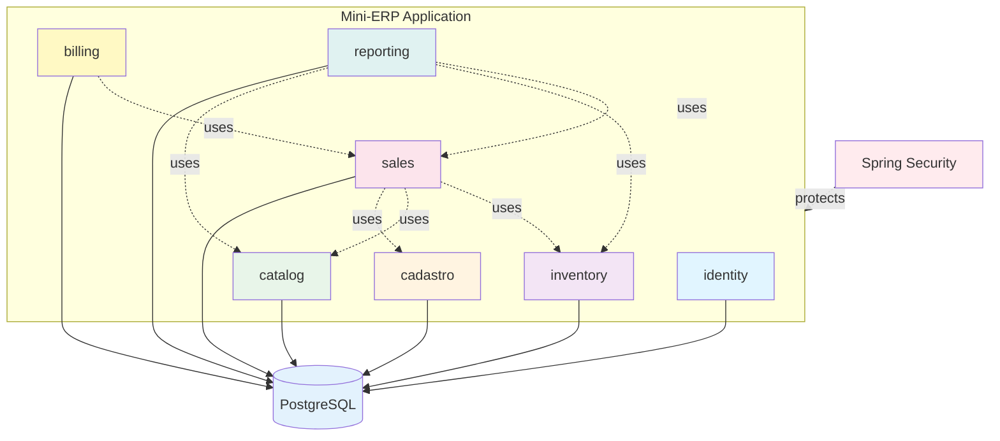
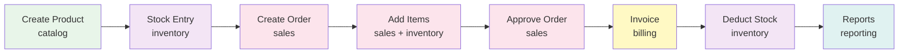

# Mini-ERP

> **Modular Monolith** - A complete and professional ERP demonstrating senior-level software architecture.

[](https://www.oracle.com/java/)
[](https://spring.io/projects/spring-boot)
[](LICENSE)

**🇧🇷 [Read in Portuguese](README-PT-BR.md)**

## About the Project

**Mini-ERP** is a complete business management system developed as a **modular monolith**, where each module is isolated by package and communicates through well-defined interfaces, without direct coupling between layers of different modules. This project demonstrates architectural maturity and software engineering best practices, maintaining local execution simplicity without the need for complex infrastructure.

### Objectives

- Demonstrate **modular monolith** architecture with clear boundaries
- Implement a functional ERP with complete business flows
- Apply senior-level practices (RBAC, auditing, testing, observability)
- Serve as a **technical portfolio** demonstrating architectural competencies

## Architecture

### Concept: Modular Monolith

The project follows the **modular monolith** pattern, where:

- Each module is **isolated by package** with clear boundaries
- Modules communicate via **interfaces** (without direct coupling)
- **Cross-module access only through Facade/Port interfaces exposed in the `api` package; all other packages are internal**
- Each module has its own internal structure (api, application, domain, infra, web)
- **No direct dependencies** between internal packages of different modules (only through exposed interfaces)
- Internal events for asynchronous communication (optional)

### Modular Architecture Diagram



### Planned Modules

#### 1. **identity** (Authentication and Authorization)
- Users, roles, and permissions
- Auditing: action tracking (who did what)
- Spring Security + RBAC

#### 2. **cadastro** (Base Records)
- Customer (Individual/Corporate)
- Supplier
- Address and contacts

#### 3. **catalog** (Products)
- Product, category, unit of measure
- Cost and price control

#### 4. **inventory** (Stock)
- Movements (entry/exit/adjustment)
- Balance per product with consistency
- Concurrency control (optimistic locking)

#### 5. **sales** (Sales/Orders)
- Sales order and items
- Status: draft → approved → invoiced/cancelled
- Stock reservation and deduction

#### 6. **billing** (Invoicing)
- Simplified invoice generation
- Payment mock
- Idempotency (don't invoice the same order twice)

#### 7. **reporting** (Reports)
- Top selling products
- ABC curve
- Low stock alerts
- Sales by period

## Technology Stack

### Core
- **Java 25 LTS** - Programming language (recommended; Spring Boot 4.0.1 requires Java 17+)
- **Spring Boot 4.0.1** - Main framework
- **Spring Security** - Authentication and authorization
- **Spring Data JPA** - Data persistence
- **Bean Validation** - Data validation

### Database
- **PostgreSQL** - Main database (via Docker Compose)
- **H2 Database** - In-memory database for quick development/testing
- **Testcontainers** - Integration tests with real PostgreSQL

### Execution Modes

The project is designed to run **without complex infrastructure requirements**, offering three execution modes:

- **Development**: H2 in-memory for quick startup without configuration
- **Integration Tests**: Testcontainers with real PostgreSQL for consistency
- **Local Demo**: Optional Docker Compose for those who want to experiment with PostgreSQL

This approach demonstrates delivery maturity: flexibility for different scenarios without unnecessary complexity.

### Observability
- **Spring Boot Actuator** - Health checks, metrics, and readiness
- **Micrometer** - Application metrics (planned)
- **Spring AOP** - Auditing and cross-cutting logs
- **Structured logs** - With correlation ID for traceability

### Testing
- **JUnit 5** - Testing framework
- **Spring Boot Test** - Integration tests
- **Testcontainers** - Tests with real PostgreSQL
- **Spring Security Test** - Security tests

### Tools (planned)
- **Flyway** - Database migration
- **Springdoc OpenAPI** - API documentation (Swagger)
- **Lombok** - Boilerplate reduction (optional)
- **MapStruct** - DTO ↔ domain mapping (optional)

## Project Structure

```
minierp/
├── src/
│   ├── main/
│   │   ├── java/com/aronalvarenga/minierp/
│   │   │   ├── identity/          # Authentication/authorization module
│   │   │   ├── cadastro/          # Base records module
│   │   │   ├── catalog/           # Products module
│   │   │   ├── inventory/         # Stock module
│   │   │   ├── sales/             # Sales module
│   │   │   ├── billing/           # Invoicing module
│   │   │   ├── reporting/         # Reports module
│   │   │   └── MinierpApplication.java
│   │   └── resources/
│   │       ├── application.properties
│   │       └── db/migration/      # Flyway migrations (planned)
│   └── test/
│       └── java/com/aronalvarenga/minierp/
├── docker-compose.yml             # Local PostgreSQL (optional)
├── build.gradle
├── settings.gradle
└── README.md
```

## How to Run

### Prerequisites

- **Java 17+** (recommended: **Java 25 LTS**)
  - Spring Boot 4.0.1 requires Java 17 or higher
- **Gradle** (or use the wrapper: `./gradlew`)
- **Docker** and **Docker Compose** (for PostgreSQL - optional, can use H2)

### Running Locally

1. **Clone the repository**
   ```bash
   git clone https://github.com/aron-alvarenga/minierp.git
   cd minierp
   ```

2. **Configure the database** (choose one option)

   **Option A: H2 (recommended for quick development)**
   - The application uses H2 by default, no additional configuration needed
   - Ideal for development and quick testing
   
   **Option B: PostgreSQL via Docker Compose (for local demo)**
   ```bash
   docker-compose up -d
   ```
   - Configure `application.properties` to use PostgreSQL
   - Ideal for those who want to experiment with a real database

3. **Run the application**
   ```bash
   ./gradlew bootRun
   ```
   or
   ```bash
   ./gradlew.bat bootRun  # Windows
   ```

4. **Access the application**
   - API: `http://localhost:8080`
   - Actuator Health: `http://localhost:8080/actuator/health`
   - Swagger UI: `http://localhost:8080/swagger-ui.html` (when implemented)

### Note on Testing

Integration tests use **Testcontainers** to run with a real PostgreSQL database, ensuring tests run in an environment close to production, even if you use H2 during development.

### Running Tests

```bash
./gradlew test
```

## Main Flows (MVP)

### Flow 1: Complete Sales Cycle



### Flow Details

1. **Create Product** → Create product in `catalog` module
2. **Stock Entry** → Register entry in `inventory` module
3. **Create Order** → Create sales order in `sales` module
4. **Approve Order** → Approve order (domain validations)
5. **Invoice** → Generate invoice in `billing` module (idempotent)
6. **Deduct Stock** → Update stock automatically
7. **Reports** → Query reports in `reporting` module

## Security and Permissions

### Planned Roles

- **ADMIN** - Full system access
- **SALES** - Order and customer management
- **STOCK** - Stock and product management

### Seed Users (planned)

- `admin` / `admin` - Administrator
- `sales` / `sales` - Salesperson
- `stock` / `stock` - Stock operator

## MVP Features

- [x] Project base structure
- [ ] Authentication and authorization (RBAC)
- [ ] Customer CRUD
- [ ] Product CRUD
- [ ] Manual stock entry
- [ ] Sales order creation and approval
- [ ] Invoice generation with payment mock
- [ ] Auditing (createdBy/updatedBy + event logging)
- [ ] Reports: top selling products and low stock

## Technical Highlights

### Senior-Level Practices

- **Idempotency** in invoicing
- Robust **domain validations**
- **Concurrency control** (optimistic locking in stock)
- **Standardized errors** (Problem Details / RFC 7807)
- **Structured logs**
- **Unit tests** and **integration tests** with Testcontainers
- **Testable contracts** between modules

## Testing

### Testing Strategy

- **Unit Tests**: Domain and use cases (business rules, validations, idempotency)
- **Integration Tests**: With Testcontainers (real PostgreSQL) - ensure consistency and production-like behavior
- **Contract Tests**: Interfaces between modules (ensure modular boundaries)
- **Security Tests**: Protected endpoints (RBAC per endpoint)

**Note**: Integration tests use Testcontainers to run with a real PostgreSQL database, even if you use H2 during development. This ensures tests validate the real application behavior.

### Running Tests

```bash
# All tests
./gradlew test

# Specific tests
./gradlew test --tests "com.aronalvarenga.minierp.identity.*"
```

## Documentation

### Planned

- [ ] **ADRs** (Architecture Decision Records) in `docs/decision-records/`
- [ ] **Architecture diagrams** (Mermaid)
- [ ] **Contribution guide**
- [ ] **API Documentation** (Swagger/OpenAPI)

## Roadmap

### v1.0 - MVP (Current)
- Base structure and core modules
- Complete sales flow
- Authentication and authorization
- Basic reports

### v2.0 - Improvements
- [ ] External API integration (ZIP code, CNPJ)
- [ ] Metrics dashboard
- [ ] Report export (PDF/Excel)
- [ ] Notifications (email)
- [ ] Distributed cache (Redis - optional)

### v3.0 - Expansion
- [ ] Purchasing module
- [ ] Financial module (accounts payable/receivable)
- [ ] Production module (if applicable)
- [ ] GraphQL API (optional)

## Contributing

This is a personal portfolio project. Contributions are welcome! Feel free to open issues and pull requests.

## License

This project is licensed under the MIT License. See the [LICENSE](LICENSE) file for more details.

## Author

**Aron Alvarenga**

- GitHub: [@aron-alvarenga](https://github.com/aron-alvarenga)
- LinkedIn: [Aron Alvarenga](https://www.linkedin.com/in/aron-alvarenga)

## Acknowledgments

- Spring Framework and Spring community
- All maintainers of the open-source libraries used

---

**Note**: This project starts with a minimal set of dependencies. Other libraries are added only when a real architectural need arises, following the **YAGNI** (You Aren't Gonna Need It) principle.
